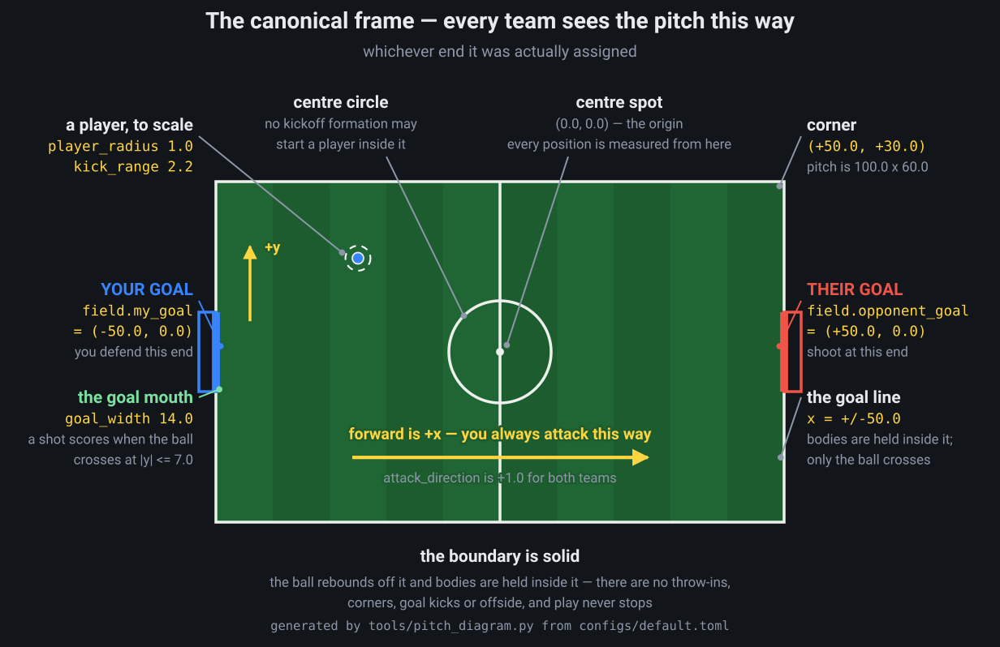

# Student guide

You write one Python file. It contains a class with one method, `act`, which is
called on every tick of the match. Everything else is done for you.

---

## 1. Set up

Download the platform from the **Downloads** tab on the course site. It is one
zip, and it already contains the simulation engine compiled for Windows, macOS
and Linux. **There is nothing to build and nothing to install** — you need
Python 3.8 or newer and nothing else.

This package is not on PyPI, and there is no `pip install` step. If you find
yourself installing a compiler you are on the wrong path; go back to the zip.

Unzip it somewhere you will find again, and open that folder. Everything in this
guide happens inside it.

| You are on | Start it with |
| --- | --- |
| Windows | double-click `START.cmd` |
| macOS or Linux | `bash start.sh`, in a terminal opened in that folder |

Either one opens the dashboard in your browser: pick two teams, press a button,
watch the match. That is the whole loop.

On macOS and Linux, `./start.sh` works from the second run onwards — some unzip
tools drop the executable bit, and the first run through `bash` puts it back.
On macOS the first run also clears the quarantine tag your browser puts on
anything it downloads — without that, macOS refuses to start the engine. That
is a reason to start through `start.sh` rather than running `launch.py`
yourself.

What is in the folder:

```text
my-team/       your team - team.py. That file IS your submission.
examples/      two more teams to read
docs/          this guide
replays/       matches you record land here
START.cmd      Windows
start.sh       macOS and Linux
```

`my-team/team.py` is already a working team, so you can change one thing and see
immediately whether it helped.

**Throughout this guide, commands are written `./start.sh <something>`. On
Windows type `START.cmd <something>` instead — the arguments are identical.**
Check that it works:

```bash
./start.sh baselines      # the reference opponents you can play
./start.sh doctor         # the Python, engine and teams it found
```

`doctor` is the first thing to run when something looks wrong: it reports what
it found rather than what it expected, which is usually the answer.

`my-team/team.py` and `examples/simple_team.py` are the same four-branch team:
about the simplest thing that still plays football, and weak on purpose. Then
read section 5, which is a fuller — still beatable — team you can paste over it
and improve from there.

---

## 2. The interface

```python
from soccer import TeamController, TeamAction, PlayerAction, direction

class MyTeam(TeamController):
    name = "my_team"      # shown in results; use your own
    version = "1"         # bump when you change behaviour

    def act(self, observation):
        """Called on every tick of the match, ball or no ball."""
        ...
        return TeamAction()
```

**One method, and it runs whatever is happening.** There is no separate
attacking method and defending method: `act` is called twenty times a second
from the kickoff to the final whistle, and it is your job to look at what you
were given and decide what kind of moment this is.

That decision is the first thing worth writing, because everything else hangs
off it. **Start by asking who the ball belongs to** — the section below and
[section 3](#3-what-you-can-see) give you three ways to answer it — and only
then decide what each player does about it:

```python
from soccer import closest_to_ball

def act(self, obs):
    if closest_to_ball(obs):
        return self.on_the_ball(obs)        # your own methods, named by you
    return self.off_the_ball(obs)
```

Splitting it in two like that is only the obvious first cut, and you are not
obliged to keep it. A better team usually ends up with more than two answers:
pressing high is not the same as sitting deep, and a keeper's decision does not
depend on the same things as a striker's.

### Three ways to ask whose ball it is

| Ask | You get | It says |
| --- | --- | --- |
| `closest_to_ball(obs)` | `True`/`False` | one of your players is nearer to the ball than any of theirs — a fact about distance, right now |
| `obs.ball.controlling_team == 0` | `True`/`False` | the engine's possession: whose ball this is to lose, which persists while it runs loose |
| `obs.ball.controlling_player` | an id, or `None` | who has it at their feet this tick — usually nobody |

They disagree, and the disagreements are the interesting part. You can be
nearest to a ball you have just lost, and you can hold possession while an
opponent is closer to a ball nobody is touching. `obs.phase` is the engine's own
label, `"ATTACK"` or `"DEFEND"`, derived from possession with a short dwell so
it does not flicker; it is there to read, but it is one opinion and not a
decision made for you.

Whatever you decide, `act` returns a `TeamAction`, and that `TeamAction` has to
carry a decision for **every one of your players, on every tick**: move
somewhere, kick the ball, do both at once, or deliberately do nothing. There is
no fifth option and nothing carries over — an action lasts one tick and is
replaced by whatever you send next.

A player you leave out of the `TeamAction` stands still. That is not an error,
but `./start.sh validate` counts it as a missing action and warns you, because far
more often it means you forgot someone than that you meant it. If you really do
want a player to stand still, say so with `PlayerAction()` and the warning goes
away.

### Where you start: `initial_formation`

There is one optional third method. Implement it and you choose where your team
lines up at a kickoff; leave it out and you get the engine's default formation.

```python
class MyTeam(TeamController):
    def initial_formation(self, field):
        return [
            (-48.0, 0.0),     # slot 0, your goalkeeper, on the goal line
            (-20.0, -12.0),
            (-20.0, 12.0),
            (-10.0, -6.0),
            (-10.0, 6.0),
        ]
```

One `(x, y)` per player in slot order, in the same canonical frame as everything
else: your goal at `field.my_goal`, theirs at `field.opponent_goal`, forward
`+x`. It is called once per match, before `reset`, and the shape is used at
**every kickoff in that match** — the opening one and every restart after a goal.

Three rules apply:

| Rule | Meaning |
| --- | --- |
| Inside the pitch | by one player radius, so nobody starts in a wall |
| Your own half | `x <= 0` |
| Outside the centre circle | at least `field.centre_circle_radius` from `(0, 0)` |

**A spot that breaks a rule is moved to the nearest spot that does not.** Ask for
`(30, 20)` and you get `(0, 20)`; ask to stand on the ball and you are pushed
straight out to the edge of the centre circle, keeping your bearing. Nothing is
refused and nothing fails, so a formation cannot cost you a match — but
`./start.sh validate` tells you how many spots were moved, and you should not be
finding that out from the viewer.

Return fewer spots than you have players and the rest take their default
positions. Return more and the extras are ignored.

### Kickoffs belong to the side taking them — and the only foul in the game

The centre circle is a rule and not just a marking because the ball starts a
kickoff dead on the centre spot, and without one, "everybody on the halfway
line" would win every restart by standing nearest to it.

So while a restart is live, **the centre circle belongs to the side taking it**.
If any of your players is inside that circle while the *other* team is taking a
kickoff, they are picked up and put on the halfway point of whichever touchline
is **further** away — and it is recorded as a **foul** against you.

That is the only foul the game has. There is no card, no free kick and no
penalty: the punishment is the walk back, which from a touchline is about four
seconds of running. Long enough that it is never worth it.

```python
for event in obs.events:
    if event["kind"] == "foul" and event["team"] == 0:
        # One of ours. event["player"] is who, event["sent_to"] is where.
        self.sent_off_count += 1
```

Three things follow, and all of them are worth designing around:

* **After you concede, the ball is yours and nobody can come near it.** That is
  a free pass to any team-mate you like — the one moment in the match where you
  are guaranteed an unopposed first touch, so it is worth using deliberately
  rather than hoofing it upfield.
* **After you score, keep out of the circle.** Chasing their kickoff taker does
  not just fail, it costs you your two nearest players for four seconds each.
  A team that charges every restart plays most of the match a man or two down.
* **Check `obs.ball.controlling_team` before you chase.** The simplest way to
  never give away a foul is to notice that the ball is on the centre spot and
  is not yours, and hold your shape until it moves.

A restart nobody takes expires after three seconds, so declining to kick off is
not a way to freeze the opposition out of the match.

Your foul count is in every result record, and the league page carries a
**Fewest fouls per game** award alongside the others.

---

## 3. What you can see

`observation` is always from your team's point of view. **You never have to
think about which end you are attacking, and you must never write code that
does.** Both sides receive the pitch in one canonical frame:

```text
        your goal                  centre                 their goal
       (-width/2, 0)               (0, 0)                (+width/2, 0)
            |                        |                        |
            +------------------------+------------------------+
                          forward is +x, always
```

Everywhere you can be, drawn to scale, with the numbers you will actually use:



Nothing on it is decorative. There is no penalty area and no offside line, the
boundary is solid, the ball rebounds off it, and play never stops for anything
but a goal. The one marking that carries a rule is the centre circle: no
kickoff formation may start a player inside it.

So `observation.opponent_goal` is the goal you are shooting at, `+x` is the way
you attack, `attack_direction` is `+1.0`, your players are ids `0 .. n-1` and
theirs are `n .. 2n-1` — identically, whichever side you were assigned. The
actions you send back are read in the same frame, so `(1.0, 0.0)` means "run at
their goal" for both teams and the engine turns it the right way round for you.

The whole object, at a glance:

```text
observation
├── tick             int    ticks played so far
├── max_ticks        int    length of the match
├── time_remaining   float  fraction still to play, 1.0 -> 0.0
├── phase            str    "ATTACK" or "DEFEND" - the engine's own reading
├── score            tuple  (yours, theirs)
├── team             int    always 0 - you are team 0, they are team 1
├── side             int    which end you drew; for logs, never for logic
│
├── my_players       list of PlayerView, slot order, ids 0..n-1
├── opponents        list of PlayerView, ids n..2n-1
│   └── PlayerView
│       ├── id                    int    canonical, stable for the match
│       ├── team                  int    0 = yours, 1 = theirs
│       ├── position              (x, y) field units, origin at the centre
│       ├── velocity              (x, y) units per second
│       ├── facing                (x, y) unit vector
│       ├── kick_cooldown_ticks   int    0 means ready to kick
│       └── has_control           bool   this player has the ball right now
│
├── ball
│   ├── position            (x, y)
│   ├── velocity            (x, y)
│   ├── controlling_player  int | None   who has it at their feet, if anyone
│   ├── controlling_team    int         0 = yours, 1 = theirs
│   └── last_touch          int | None   who touched it most recently
│
├── field
│   ├── width, height       float  the pitch, e.g. 100.0 x 60.0
│   ├── goal_width          float  the full mouth: a shot scores at |y| <= w/2
│   ├── my_goal             (-width/2, 0)   always
│   ├── opponent_goal       (+width/2, 0)   always
│   ├── attack_direction    float  always +1.0
│   ├── player_radius       float  bodies are circles
│   ├── ball_radius         float
│   ├── centre_circle_radius float no kickoff formation may start inside it
│   ├── kick_range          float  how close you must be to strike it
│   ├── kick_impulse        float  ball speed added by a full-power kick
│   ├── max_speed           float  top running speed, for timing a run
│   ├── acceleration        float  how fast you can change velocity; turn cost
│   ├── simulation_hz       float  ticks per second, for turning ticks into time
│   ├── ball_friction       float  what a rolling ball's speed is multiplied by,
│   │                              every tick - the whole of the ball's physics
│   ├── ball_air_friction   float  the same, while the ball is off the ground
│   ├── gravity             float  pulls an airborne ball down
│   ├── bounce_restitution  float  the share of falling speed a bounce returns
│   ├── bounce_friction     float  what a bounce costs the ball horizontally
│   └── min_bounce_speed    float  below this, a bounce is the ball settling
│
└── events           list of dicts - see below
```

Positions and velocities are plain `(x, y)` tuples in field units, with the
origin at the centre spot; velocities are per second, and `facing` is a unit
vector. The only fields that go `None` are the two ball ids marked so:
`controlling_player` is unset whenever the ball is loose — typically over 90%
of a match — and `last_touch` until someone first touches it.

The two possession fields answer different questions, and the difference
matters. `controlling_team` is never `None`: possession persists across a loose
ball, so it says whose ball this is to lose, and it is what `obs.phase` is
derived from. `controlling_player` says who has it at their feet *this tick*,
and is usually nobody. Test the team, not the player, when what you mean is
"are we on the ball".

A worked example, since the two id ranges are the thing people trip over:

```python
keeper = obs.my_players[0]              # slot 0 is always your goalkeeper
assert keeper.id == 0                   # ... and its id is always 0

we_have_it = obs.ball.controlling_team == 0        # 0 is you, on either side
holder = obs.ball.controlling_player               # an id, or None
if holder is not None and holder < len(obs.my_players):
    carrier = obs.my_players[holder]               # ids 0..n-1 index directly
```

Your ids double as list indices; theirs do not, because opponents are numbered
`n..2n-1` so that no id is ambiguous about whose player it is. Build a lookup
when you need one — `{o.id: o for o in obs.opponents}` — and index it by the
opponent ids you decided to mark.

### Events

`obs.events` is what happened **since your previous decision** — usually empty,
occasionally several. Each is a plain dict with a `kind` and a `tick`, plus
keys that depend on the kind. Ids, team ids and directions in an event are in
your frame, exactly like the rest of the observation.

| `kind` | Other keys | When |
| --- | --- | --- |
| `"kick"` | `player`, `team`, `direction`, `power` | someone struck the ball |
| `"kick_rejected"` | `player`, `team`, `reason` — `"out_of_range"`, `"on_cooldown"` or `"out_of_reach"` | a kick you asked for did not happen |
| `"foul"` | `player`, `team`, `sent_to` | that player encroached on the opposition's kickoff and was moved to `sent_to` |
| `"turnover"` | `from_team`, `to_team`, `player` | possession changed hands |
| `"goal"` | `team`, `scorer`, `own_goal` | `team` is who it counts for |
| `"policy_timeout"` | `team`, `elapsed_ms` | a decision missed the deadline |
| `"policy_error"` | `team`, `message` | a controller raised |
| `"terminal"` | `reason` | the match ended |
| `"collision"` | `a`, `b` | two players overlapped; off unless the viewer asks for them |

```python
for event in obs.events:
    if event["kind"] == "goal" and event["team"] == 1:
        self.concede_count += 1          # they scored
    elif event["kind"] == "kick_rejected" and event["reason"] == "on_cooldown":
        ...                              # you are asking too early
```

Two shapes worth knowing before they surprise you. A kick's `direction` is a
dict, `{"x": ..., "y": ...}`, not a tuple like the coordinates elsewhere. And
`terminal`'s `reason` is the string `"time_limit"`, or the nested
`{"forfeit": {"team": 0}}` when a team was disqualified.

`kick_rejected` is the one to read while you are debugging. A team that thinks
it is shooting and is quietly out of range every time looks identical to a team
that is not trying.

### Helpers

These are computed by the engine, so they agree exactly with what the reference
teams use:

```python
obs.closest_my_player_to(point)          # nearest of yours; ties break on lower id
obs.closest_opponent_to(point)
obs.my_players_by_distance_to(point)     # sorted nearest-first
obs.can_kick(player_id)                  # in range and off cooldown?
obs.normalise(point) / obs.denormalise(point)   # the same frame, scaled to [-1, 1]
obs.ticks_to_cover(distance, power)      # how long a kick takes to get there
obs.simulation_hz()                      # ticks per second, to turn ticks into time
```

That is the whole list, and the gaps in it are on purpose. Where the ball is
heading, where to meet it, where your players should stand, who they should
pick up, whether a pass is on — none of those are facts about the match. They
are the decisions your team exists to make, and if the engine made them for
you, every submission in the class would play the same football.

So it gives you the ingredients instead. The bodies and the ball are in the
observation, and the ball's physics is on `field`. Rolling it forward is six
lines:

```python
def predict_ball(obs, ticks):
    """Where the ball will be, under the drag the engine applies."""
    dt = 1.0 / obs.field.simulation_hz
    x, y = obs.ball.position
    vx, vy = obs.ball.velocity
    for _ in range(ticks):
        x, y = x + vx * dt, y + vy * dt
        vx, vy = vx * obs.field.ball_friction, vy * obs.field.ball_friction
    return x, y
```

That is exactly what the engine does to the ball each tick, so this agrees with
the simulator to the pixel — as long as nobody gets in the way, which is the
one thing it does not model.

Three things worth building on top of it.

**Nearest is not the same as first.** `my_players_by_distance_to` answers "who
is closest *now*", which is the wrong question whenever the ball is moving: a
player the ball is rolling towards beats a nearer one who has to turn round and
chase it. With `field.max_speed`, `field.acceleration` and a prediction, you can
compare arrival *times* instead, which is what the strongest reference teams do.

**Meet the ball, don't chase it.** The point on the predicted path closest to a
player is where they should run — `closest_point_on_segment(from_position,
obs.ball.position, predict_ball(obs, 40))` is the whole of it.

**Lead your passes.** A 20-unit pass is in the air for over two seconds, in
which a sprinting team-mate covers nearly 18 units, so aiming at where they
*are* misses almost every time. Guess a lead point, ask `obs.ticks_to_cover`
how long the ball needs to reach it, move the guess by how far the receiver
travels in that time, and repeat — it settles after two or three rounds.

And from `soccer` itself: `closest_to_ball`, `direction`, `distance`,
`normalise`, `lerp`, `clamp`, `scale_to_length`, `closest_point_on_segment`,
`Vec2`.

```python
from soccer import closest_to_ball

closest_to_ball(obs)     # is one of mine nearer to the ball than any of theirs?
```

---

## 4. What you can do

One decision per player, per tick. Pick one of these four for each of them:

| You want a player to | Write |
| --- | --- |
| run somewhere | `actions.move(id, run)` |
| strike the ball, from a standstill | `actions.kick(id, aim, kick_power=1.0)` |
| run *and* strike the ball | `actions.kick(id, aim, 1.0, movement=run)` |
| nothing at all, on purpose | `actions.set(id, PlayerAction())` |

```python
actions = TeamAction()

actions.move(player_id, (1.0, 0.0))                       # run this way
actions.kick(player_id, direction_to_goal, kick_power=1.0)  # strike the ball
actions.set(player_id, PlayerAction(
    movement=direction(player.position, obs.ball.position),
    kick_direction=direction(player.position, obs.opponent_goal),
    kick_power=0.4,                                        # a soft touch
))
```

- `movement` is a direction. Its length doubles as a throttle in `[0, 1]`;
  anything longer is scaled down, so you cannot outrun the speed limit by
  returning a big vector.
- `kick_power` is clamped to `[0, 1]`. A kick only lands if you are within
  `field.kick_range` of the ball and off cooldown — otherwise it is rejected
  and counted against you. `obs.can_kick(id)` tests both.
- You can move and kick on the same tick.
- `movement` and `kick_direction` are in the same frame you were shown, so
  `(1.0, 0.0)` is "towards their goal" no matter which side you drew.

### Cover every player, every tick

Each of `move`, `kick` and `set` **replaces** that player's whole action rather
than adding to it. This is the mistake to know about before you make it:

```python
actions.move(3, run)                 # player 3 runs
actions.kick(3, aim, 1.0)            # ... and now player 3 kicks from a
                                     # standstill: this wrote a fresh action
                                     # whose movement defaults to (0, 0)

actions.kick(3, aim, 1.0, movement=run)   # what you meant: run and kick
```

So the shape to write is a single loop with exactly one branch per player:

```python
for player in obs.my_players:
    if ...:
        actions.kick(player.id, aim, 0.6)
    elif ...:
        actions.move(player.id, run)
    else:
        actions.set(player.id, PlayerAction())     # holding position, on purpose
```

`./start.sh validate` reports `missing player actions`: player-ticks where you sent
nothing at all. The explicit `PlayerAction()` in that last branch is what keeps
the count at zero while still standing the player still.

### How far a kick goes

`kick_power` is not a distance. It is a fraction of `field.kick_impulse`, the
speed a full-power kick adds to the ball — **22 field units per second** on the
course profile, so power 0.5 leaves the boot at 11. The ball then loses 1.5% of
its speed every tick, twenty ticks a second, and it is the distance that comes
out of that which you are really choosing:

| `kick_power` | speed off the boot | after 1 s | after 2 s | left to roll |
| --- | --- | --- | --- | --- |
| 0.2 | 4.4 | 3.8 | 6.7 | 15 |
| 0.4 | 8.8 | 7.7 | 13.3 | 29 |
| 0.6 | 13.2 | 11.5 | 20.0 | 44 |
| 0.8 | 17.6 | 15.3 | 26.6 | 59 |
| 1.0 | 22.0 | 19.1 | 33.3 | 73 |

Distances are field units, on a pitch 100 long and 60 wide — so a full-power
kick covers a third of its length in two seconds, and even a gentle 0.4 rolls
half the width of it if nobody intervenes. Two rules of thumb fall out of that:

```text
kick_power ≈ distance / 33     arrives in about two seconds
kick_power ≈ distance / 73     the least that ever reaches — it arrives crawling
```

Use the first for a pass. The last column is where the ball comes to rest if
nothing touches it at all, which takes the better part of half a minute; size a
pass by it and a defender strolls onto the ball long before it arrives.
`obs.ticks_to_cover(distance, power)` is the engine's own version of this table,
so prefer it to a constant you tuned by eye.

Three more things that follow from the impulse being a speed:

- It is **added to the ball's current velocity**, not set. Striking a ball
  already rolling your way sends it further; striking one rolling at you partly
  cancels out, and a hard kick at a ball coming straight at you can leave it
  barely moving. The engine caps the result at 30 units/s.
- **Power is not accuracy.** The ball goes exactly where `kick_direction`
  points, at the speed you asked for. Overhit passes are what fill the
  *uncollected* column of your statistics.
- **0.5 is the line between a strike and a touch.** At or above it a kick counts
  as a shot or an attempted pass; below it, it is a touch, and one you run onto
  yourself is a dribble.

### Things the engine will quietly fix, and count

| You returned | What happens |
| --- | --- |
| a movement vector longer than 1 | scaled down to length 1 |
| `kick_power` outside `[0, 1]` | clamped |
| `NaN` or infinity | that component is rejected; the player does nothing |
| no action for a player | that player stands still |
| an action for an id that is not one of yours — an opponent's `n .. 2n-1`, or no one's | ignored, and counted |
| a huge `debug` payload | debug discarded, your actions kept |

None of these crash your team, but all of them show up in `./start.sh validate` and
in your result record. A team that relies on them is losing ticks.

---

## 5. A first team, in full

Everything above, in one file that runs. Paste it over `my-team/team.py` and
play it:

```python
"""my-team/team.py - a complete, working first team."""

from soccer import (
    TeamAction, TeamController, clamp, closest_to_ball, direction, distance,
)


class MyTeam(TeamController):
    name = "my_team"
    version = "1"

    def act(self, obs):
        # The one method the engine calls. Everything starts with deciding
        # what kind of moment this is; this team asks the simplest question
        # there is, and you should expect to outgrow it.
        if closest_to_ball(obs):
            return self.on_the_ball(obs)
        return self.off_the_ball(obs)

    def on_the_ball(self, obs):
        actions = TeamAction()
        chaser = obs.closest_my_player_to(obs.ball.position)

        # Every one of your players goes through this loop exactly once and
        # leaves it with exactly one action.
        for player in obs.my_players:
            if player.id == 0:
                # Keeper: hold the goal line, slide across with the ball.
                mouth = obs.field.goal_width / 2
                spot = (obs.my_goal[0] + 2.0,
                        clamp(obs.ball.position[1], -mouth, mouth))
                actions.move(player.id, direction(player.position, spot))

            elif player.id == chaser.id:
                # The nearest player, and only that one, goes to the ball.
                if obs.can_kick(player.id):
                    # Power sized to the distance: see "How far a kick goes".
                    gap = distance(player.position, obs.opponent_goal)
                    actions.kick(
                        player.id,
                        direction(player.position, obs.opponent_goal),
                        kick_power=min(1.0, gap / 33.0),
                    )
                else:
                    actions.move(
                        player.id,
                        direction(player.position, obs.ball.position),
                    )

            else:
                # Everyone else spreads out ahead of the ball, one lane each.
                # Two lines, and no cleverness at all: the lane is fixed to the
                # slot, so these four never swap sides however the play moves.
                lane = (player.id - 2) * (obs.field.height * 0.2)
                spot = (obs.ball.position[0] + 15.0, lane)
                actions.move(player.id, direction(player.position, spot))

        return actions

    def off_the_ball(self, obs):
        actions = TeamAction()
        chaser = obs.closest_my_player_to(obs.ball.position)

        for player in obs.my_players:
            if player.id == 0:
                mouth = obs.field.goal_width / 2
                spot = (obs.my_goal[0] + 2.0,
                        clamp(obs.ball.position[1], -mouth, mouth))
                actions.move(player.id, direction(player.position, spot))

            elif player.id == chaser.id:
                actions.move(
                    player.id, direction(player.position, obs.ball.position)
                )

            else:
                # Mark goalside: stand between the nearest opponent and the
                # goal you defend, which is always at -x. Nothing stops two of
                # your players picking the same opponent — see section 11.
                them = obs.closest_opponent_to(player.position)
                if them is None:
                    spot = obs.my_goal
                else:
                    spot = (them.position[0] - 3.0, them.position[1])
                actions.move(player.id, direction(player.position, spot))

        return actions
```

```bash
./start.sh validate my-team
./start.sh play my-team --against ball_chaser
```

To watch it rather than read its numbers, start the dashboard — `./start.sh` on
its own, or double-click `START.cmd` — pick `my-team` and an opponent, and choose
**Record and watch**.

It passes validation with no missing actions and no timeouts, and it scores —
then usually loses to `ball_chaser`, by about a goal or two, and occasionally
sneaks a win. That is the point of it: it is a correct team, not a good one,
and it is short enough that you can see where every improvement in section 11
would go.

Five habits in it are worth keeping when you replace the rest:

- **Decide what kind of moment it is first**, once, at the top of `act`, rather
  than asking again inside every branch.
- **One loop over `obs.my_players`, one action each.** No player falls through.
- **One chaser.** Everyone chasing the ball is the single biggest thing that
  separates a first team from a competent one.
- **Power sized to the distance**, rather than 1.0 everywhere.
- **`obs.can_kick()` before kicking**, so you are not spending ticks on kicks
  the engine rejects.
- **Every line of the football is yours.** There is no engine call for "where
  should this player stand" or "who should mark whom", and there is not going
  to be. The observation tells you where everybody is; turning that into a
  shape is the whole assignment.

`examples/simple_team.py` is a plainer team than this one — four branches and
nothing else, the same as the `my-team/team.py` you were given — and
`examples/annotated_team.py` adds the viewer overlays from the next section.

---

## 6. Showing your working

The viewer can draw what your team is thinking. This is free — the simulator
ignores it completely, and it is switched off during grading.

```python
return actions.annotate(
    roles={p.id: "striker" for p in obs.my_players},
    targets={p.id: (10.0, 4.0)},
    passes=[{"from": (0, 0), "to": (20, 5)}],
    marks=[{"from": (0, 0), "to": (-20, 5)}],
    text="pressing",
)
```

Then record a match and open it: the dashboard's **Record and watch** does both,
and the annotations are drawn on the pitch beside the players that emitted them.
From the command line, ask for them explicitly — a recording made without this
carries no annotations, and the viewer has nothing to draw:

```bash
./start.sh play my-team --against balanced --replay replays/game.rep --debug-overlays
```

See `examples/annotated_team.py` for a worked example.

### Showing the options you turned down

Four further keys draw the *choice* rather than the outcome, which is usually
the more useful picture: a shot that missed tells you less than the four other
angles that were blocked at the time. The viewer has a **why** toggle for the
first three and a **heatmap** toggle for the last.

```python
return actions.annotate(
    # Ticks until each player could meet the ball, and where. `go` marks the
    # one you sent.
    race={p.id: {"eta": 14.0, "at": (12.0, -3.0), "go": p.id == chaser}},
    # Sights of goal, taken and rejected. `open` decides the colour.
    shots=[{"player": me.id, "from": me.position, "chosen": 2, "rays": [
        {"to": (50.0, 4.0), "room": 3.1, "need": 1.3, "open": True}]}],
    # The same for passes; `why` is your own label for the rejection.
    pass_options=[{"player": me.id, "from": me.position, "chosen": None,
                   "options": [{"mate": 3, "to": (18.0, 6.0), "room": 1.2,
                                "need": 4.0, "gain": 9.0, "why": "blocked"}]}],
    # A scored grid: `origin` is the centre of cell 0, `step` the spacing, and
    # `cells` runs row by row with 0-255 shading.
    heat={"cols": 19, "rows": 11, "origin": (-45.0, -25.0), "step": (5.0, 5.0),
          "players": {me.id: {"role": "support", "best": 47, "cells": [...]}}},
)
```

You write all of it in your own frame — your ids, your `+x` — and the engine
converts it for the viewer, exactly as it does for `targets`. Keep the whole
payload under `evaluation.max_debug_bytes` (8 KB by default): an oversized one
is dropped whole rather than trimmed.

### Reading one player

**Click a player in the viewer.** A panel opens and follows them, tick by tick:
where they are, how fast, which way they are facing, how long until they can
kick again, how far they are from the ball and whether they could actually
reach it — plus the role and target your controller annotated, the last kick
they struck and how long ago, and their totals for the match so far: distance
covered, kicks, kicks rejected and why, balls won. Press `Esc`, or click empty
grass, to close it.

The two lines at the top are the ones to read first:

```text
asked    run + kick 1.00      <- the PlayerAction you returned for this tick
doing    struck the ball      <- what the engine made of it
```

**`asked` is your own decision, played back to you.** Every tick of a recorded
match stores the action each player was given, so you are not guessing from the
outcome: if you think you sent a player somewhere and `asked` says
`hold position`, the bug is in your code before the ball is ever involved. And
when `asked` says `run` while `doing` says `standing`, your decision arrived
intact and something on the pitch — a team-mate in the way, a touchline — ate
it. Those are different bugs and this is how you tell them apart.

At the same time the pitch shows you both: a **violet arrow** for the movement
you asked for and a **pale blue** one for where they are actually travelling.
While a player is doing as they are told, the two sit on top of each other. When
they come apart, that gap is the answer. Alongside them are a dashed line to the
ball when it is close enough to play, a dashed line to the target you annotated,
and an orange arrow for the kick they just struck.

Two things worth knowing. `asked` shows the action **after** the engine's own
tidying — a movement vector you sent at length 5 reads as length 1, because that
is what actually ran; `./start.sh validate` is where you find out you are being
clamped. And on a replay recorded before this existed, `asked` reads
`not recorded` rather than pretending you asked for nothing.

The `can kick` line is the same test `obs.can_kick()` makes, so a player who
looks like they are ignoring the ball will tell you which of the two reasons
it is.

---

## 7. Running your team

Everything runs out of the folder you unzipped, and a team is named by its
**folder** — `my-team`, not a path to a file.

```bash
./start.sh check                                    # do this before you upload
./start.sh validate my-team                         # does it play legally?
./start.sh play my-team --against balanced          # one match, with statistics
./start.sh play my-team --against balanced --replay replays/game.rep   # record it
./start.sh tournament my-team --seeds 1000..1020    # many matches, in parallel
./start.sh baselines                                # the opponents you can play
./start.sh                                          # the dashboard, in your browser
```

### The same commands on each platform

The distribution is the same on all three; only the way you invoke it differs.
Open a terminal **in the unzipped folder** and use the row for your machine:

| Platform | Terminal | Write it as | Note |
| --- | --- | --- | --- |
| Windows | Command Prompt, PowerShell or Terminal | `START.cmd check` | double-clicking `START.cmd` opens the dashboard instead |
| macOS | Terminal | `./start.sh check` | first run must be `bash start.sh`; `./start.sh` works from then on |
| Linux | any shell | `./start.sh check` | same first-run note |

Arguments are identical in all three. If a command works for a classmate on a
different machine, it works for you with the leading word swapped — so when this
guide says `./start.sh play …`, Windows reads `START.cmd play …`.

`check` is the one to run before you hand anything in. It applies the same checks
the marking pipeline applies — that your team is one file called `team.py`, and
that it loads and plays inside the deadline — so a submission that passes here is
one the marker will accept.

### Playing against a team of your own

You are not limited to the reference opponents. Make a second team and play the
two against each other:

```bash
./start.sh new their-team          # a fresh, valid submission to play against
./start.sh play my-team --against their-team
```

Both folders appear in the dashboard's dropdowns too, so you can watch the match
as well as read its numbers.

### Who to play against

Opponents you can name, roughly weakest first: `do_nothing`, `random_legal`,
`ball_chaser`, `structured_attack`, `man_marking`, `possession`, `balanced`,
`tactical`. Work up from `ball_chaser`. `balanced` is the reference opponent —
the one to measure yourself against. `tactical` is the strongest and beats every
other baseline; treat drawing with it as a good result.

Two are worth studying rather than just playing.

`possession` completes about three times as many passes as any other baseline,
because it leads its passes rather than aiming at where a team-mate currently
stands. If your passing is poor, record a match against it from the dashboard,
watch what it does with the ball, and read "lead your passes" in the API
section above.

`tactical` is built from three ideas you can use directly. It ranks shots and
passes by *how much room the lane has* rather than accepting the first clear
one, so it can prefer the better of two open options. It requires more room for
a longer pass, because a lane measured now is used two seconds later, by which
time a defender has moved. And it steers around bodies instead of walking into
them. None of that needs anything the SDK does not give you.

### Reading the output

```text
  possession                     69.1%       30.9%
    of which controlled           7.1%        0.4%
```

`possession` is the tactical kind — who the engine credits with the ball,
including while it is loose. It is the same reading as
`obs.ball.controlling_team`, totalled over the match.

`ball at feet` is how often one of your players actually had the ball under
close control: near it *and* moving with it. Both are percentages of the whole
match, so compare them directly — but note that `ball at feet` is not a slice of
`possession`, and can even exceed it, because you have the ball the instant you
win it while possession takes a moment to change hands.

A big gap between the two means the ball is loose most of the time: you are
kicking it away rather than keeping it.

Three more worth watching:

- **shots** and **shots blocked** — shots are firm goal-bound strikes from the
  attacking half; a defender blocks one by making the next touch.
- **dribbles** and **mean dribble length** — a dribble is you kicking the ball
  and then collecting it yourself. Long dribbles mean you are carrying the ball
  upfield rather than hoofing it and hoping.
- **passes completed** and **mean pass length** — a pass is a *struck* kick
  (power 0.5 or more) that a different team-mate then collects. A soft touch is
  a dribble, not an attempted pass, so nudging the ball forward will not flatter
  your completion rate.

Every attempted pass ends up in exactly one of three buckets, so the row always
adds up:

```text
attempted = completed + intercepted + uncollected
```

*Intercepted* means an opponent got there first — aim better or pick a clearer
lane. *Uncollected* means nobody reached it at all — usually a hopeful hoof.

**tackles won** is `won/attempted`. A tackle is challenging a player who has the
ball under control; running onto a loose ball does not count. It is won if
possession actually changes to you.

If your pass completion is near zero, you are probably striking the ball at
full power towards nobody in particular. Aim at a team-mate, check that no
opponent is sitting on the line between you first, and pick a power that gets
it there without overrunning.

---

## 8. Speed matters

You get **20 ms per decision** for the whole team. That is a lot — the example
team uses about 0.015 ms — but it is a hard limit. A decision that overruns
repeats your previous action and counts as a timeout. Twenty consecutive
failures forfeits the match.

`./start.sh validate` reports your slowest decision. If it is anywhere near half the
deadline, look at what you are doing per tick.

---

## 9. What you hand in

**One file: `my-team/team.py`, uploaded to Moodle.** That is the whole
submission. There is nothing to zip, no folder to name and no form to fill in —
Moodle already knows who you are, and your name on the leaderboard comes from
there. What you have been debugging all along is exactly what you hand in.

```text
my-team/
  team.py       all of your code, in this one file   <- upload this
```

`team.py` must contain exactly one `TeamController` subclass. **A second `.py`
file is rejected** — your team file is loaded on its own, so `import helpers`
works on your laptop and fails on the server. Everything goes in `team.py`, and
it must keep that name.

Check it before you hand it in:

```bash
./start.sh check
```

That is the same check, in the same order, that the server runs. If it passes
here it will be accepted there.

---

## 10. Practice and grading

- Public seeds for practice: **1001–1005**. Grading uses a separate hidden set.
- You play **every other team in the class**, and each pairing plays the whole
  seed set from both ends with alternating kickoff. There is no advantage in one
  side, and no single match decides anything.
- Points are per match: three for a win, one for a draw, then goal difference.
- The table is then cut into **divisions of twenty** on points, top down, and
  inside a division you are ordered on your **mean decision time — less is
  better**. Points alone decide which division you are in; everyone in a band
  wins about as often, so what separates you there is what your football cost to
  compute. A team a point behind you can finish above you, but never in a better
  division. Your decision time is shown next to your points on the standings.
- Kickoff positions vary slightly with the seed. A team that only works from one
  exact starting formation will not survive the seed set — judge yourself over
  `./start.sh tournament`, never a single match.
- Outcome (win/draw/loss and goal difference) leads. Reliability — errors,
  timeouts, invalid actions — is also recorded.
- A team that raises repeatedly, or that never returns from a decision, forfeits
  that match 0-3. It is stopped rather than allowed to hold up the tournament.

---

## 11. Ideas, roughly in order of payoff

1. **Stop everyone chasing the ball.** One player goes; the rest take shape.
2. **Keep a goalkeeper.** Slot 0 on the goal line, tracking the ball's y.
3. **Pass instead of shooting from everywhere.** Write yourself a lane test —
   `closest_point_on_segment` gives you the distance from each opponent to the
   line of the pass — and only pass forwards. Measuring how much *room* the
   lane has, rather than answering yes or no, lets you rank two open passes.
4. **Vary kick power.** Full power is a shot. A light touch pushes the ball
   ahead so you can run onto it. Size a pass with `power ≈ distance / 33` rather
   than striking everything at 1.0.
5. **Mark goalside.** Stand between your opponent and the goal you defend, not
   on top of them.
6. **Respond to turnovers.** Check `observation.events` for `turnover`.
7. **Use the cooldown.** After you kick, you cannot kick again for a few ticks —
   plan the next move during them.
8. **Pick your formation, then use the kickoff it gives you.** `initial_formation`
   decides who is nearest the ball at every restart, and the side taking a
   kickoff cannot be challenged for it. A first touch nobody can contest is
   worth more than a shape that merely looks tidy.
9. **Stop chasing restarts.** Every foul costs you a player for about four
   seconds. Not conceding them is free, and there is an award for it.

---

## 12. When something goes wrong

| Symptom | Likely cause |
| --- | --- |
| `no TeamController subclass found` | your class does not inherit `TeamController` |
| `does not implement act()` | your decision method is named something else; it has to be `act(self, observation)` |
| players drift and stop | you returned no action for them |
| your kicks do nothing | out of `kick_range` or still on cooldown — `obs.can_kick(id)` tests both |
| the team freezes for a spell | an exception; run `./start.sh validate` to see it |
| great in one match, poor in a tournament | you tuned to one seed |
| your formation is not where you put it | a spot broke one of the three rules and was moved to the nearest legal one; `./start.sh validate` counts them. Kickoff jitter also nudges everyone by up to 1.5 units |
| a player teleports to a touchline | they stepped inside the centre circle while the other side was taking a kickoff. That is a foul; keep out of the circle until the ball moves |
| you are conceding fouls and do not know why | you are chasing the ball at restarts. Check `obs.ball.controlling_team` and hold your shape until the kickoff is taken |

`./start.sh check` reproduces almost all of these locally, before the
server ever sees your code.
